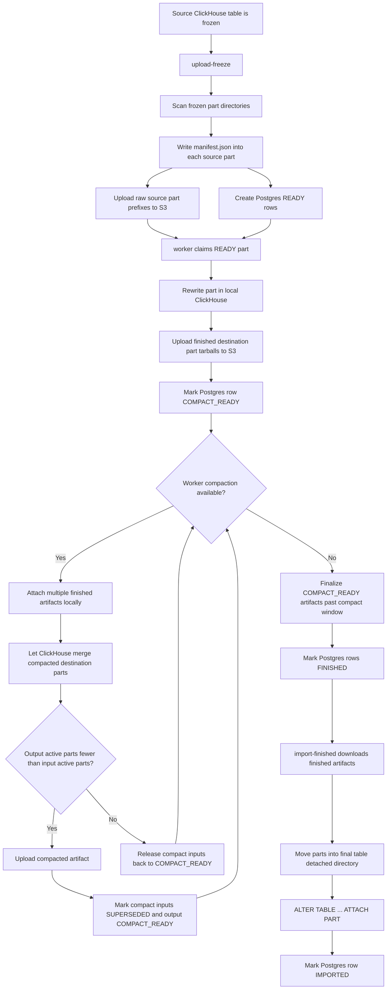
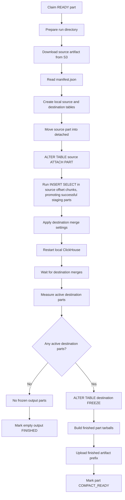
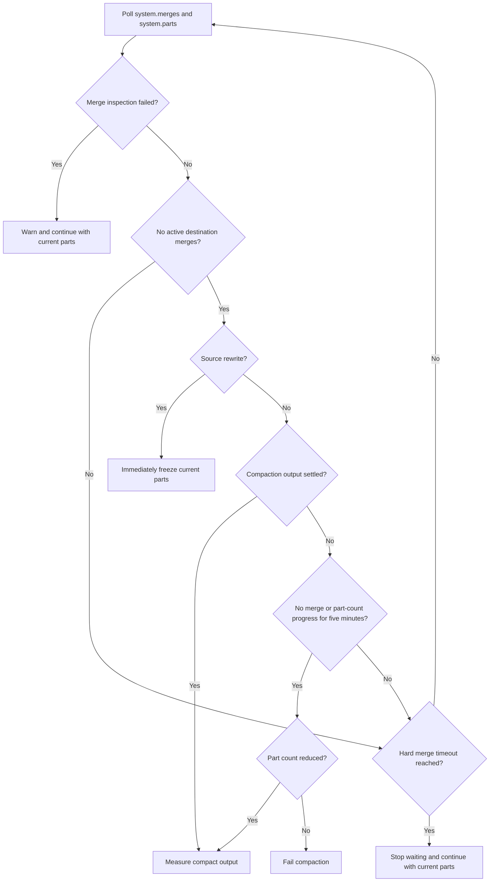

# Rewrite Flow

This document describes the current part rewrite procedure. Source rewrites produce compact-ready artifacts first. Workers then opportunistically compact those artifacts when no source rewrite work is ready, or finalize the remaining compact-ready artifacts after the configured compaction window.

Compaction only normalizes artifacts that contain multiple physical parts in one destination partition. It processes one artifact at a time and lets ClickHouse select background merges.

## Job-Level Flow

## Worker Part Flow

`upload-freeze` records each source artifact's on-disk byte size, and rewrite workers claim the largest `READY` artifact first. The insert-select step has its own resource retry loop. The worker caps query memory at 70% of detected memory and initially sets `max_threads` and `max_insert_threads` to half the detected CPU count. The first attempt keeps ClickHouse's default block size. JSON String buffer growth is capped at 64 MiB per step (`input_format_json_max_string_column_growth_step = 67108864`), limiting excess allocation rather than total memory. If ClickHouse returns a retryable resource error such as memory pressure, too many threads, or a UDF pipe read timeout, the worker halves each configured thread limit (`max_insert_threads` and `max_threads`) independently down to one and halves `max_block_size` down to an 8,192-row floor; truncates the insert target, preserving its schema and compression settings; waits with a short backoff; and retries the insert-select. Destination merge settings are applied only after the insert-select succeeds. Retry delays are 1, 2, 4, 8, then 10 seconds. The worker reads ClickHouse's current default block size only after the first resource failure. Block reductions continue even when threads are already at one; an error at both floors stops retries and records the final attempt, thread limits, and block size. Explicit block sizes below the floor are preserved. SQL-level `SETTINGS` can override the worker limits; do not override the thread settings in the insert-select.

A rewrite producing zero destination parts skips artifact upload and transitions directly to `FINISHED`, with `empty_output` recorded in state. Importing it marks it imported without downloading or attaching parts. Nonempty artifacts still require matching frozen part directories.

## Local Insert Checkpoints

Workers use up to 20 source-offset chunks per part. `-insert-chunk-min-rows` defaults to 10,000,000; the chunk count is `min(20, max(1, floor(source_rows / minimum)))`. Ranges divide the rows evenly (differing by at most one row), so no final tiny tail is created. Parts below 20 million rows use one insert, 20 million rows use two chunks, and 200 million or more use 20. Set the flag to `0` to disable chunking, or increase it for larger minimum chunks. This row-based default is a starting point, not a guarantee of chunk duration or memory usage.

Chunking requires SQL whose results can be concatenated across independent source ranges: per-row transformations and filters are suitable. Use `-insert-chunk-min-rows=0` for SQL requiring the whole source part, such as global aggregates, windows, DISTINCT, LIMIT, FINAL, or joins between different source rows. External inputs and transformation behavior must remain consistent across chunks. The worker does not attempt to prove arbitrary SQL is safe to split.

The worker stops source merges before attaching the frozen part and requires exactly one source part for chunked inserts. ClickHouse's native `additional_table_filters` setting restricts every read of that source table to the current half-open `_part_offset` range, including reads in UNION ALL branches. This setting is reserved during chunked inserts and must not appear in the supplied SQL or insert settings. No SQL text rewriting or output offset column is required.

The existing destination name serves as staging; an identical `__partforge_completed` table accumulates successful output. Once a chunk's INSERT SELECT succeeds, the worker moves every staging partition into the completed table using `MOVE PARTITION ID ... TO TABLE`. These local moves reuse existing parts. Empty chunks advance without a move. Query IDs stay unique across chunks and retries. A retryable insert error truncates only staging and retries the same range with reduced resource settings; those reductions also apply to subsequent chunks. A partition promotion failure stops the forge and is never routed back into the insert retry loop, since some partitions may already have moved.

After every chunk succeeds, the worker exchanges the completed and staging table names, drops the empty staging table, and runs the existing final merge/restart/freeze/upload flow once. There is no per-chunk archive, S3 transfer, or server restart. Logs report `chunk`, `chunks`, and completed source offsets; read/write counters accumulate successful chunks plus the current attempt. `SELECT_PROGRESS` weights completed source ranges and the current query's estimated read fraction across the whole source part. Retrying discards only the current attempt's progress; committed empty ranges advance too. The worker persists this percentage separately from read counters, because a query can scan the source repeatedly or skip ranges without reading rows. `total_rows_approx` extrapolates the active range's read estimate over the remaining input. Overall insert duration covers all chunks, and successful chunks do not set the metrics' `retried` label. Retry waste excludes successful chunk queries and partition promotion time.

These checkpoints only survive handled query failures while the worker and local ClickHouse remain alive. They do not recover a killed process/container or a lost node, and no offsets are persisted as remotely durable checkpoints. S3 publication and the Postgres completion transition still happen once per source part.

## Destination Merge Settings

After a successful insert-select and before the ClickHouse restart, the worker applies these destination table settings:

- `merge_max_block_size`
- `merge_max_block_size_bytes`
- `merge_selecting_sleep_ms`
- `max_bytes_to_merge_at_max_space_in_pool`
- `max_bytes_to_merge_at_min_space_in_pool`

Server-level merge pool tuning is not applied to rewrite/inserter ClickHouse processes.

Compactor ClickHouse processes start with a single-threaded `round_robin` merge pool and a concurrency ratio of one, limiting each worker to one active merge. The same tuning is retained when ClickHouse restarts after compact inputs are attached.

The per-table `merge_max_block_size_bytes` starts at no more than ClickHouse's 10 MiB default. When the compaction observer finds a new background `MergeParts` failure with ClickHouse error code 241 (`MEMORY_LIMIT_EXCEEDED`), it stops merges for that table, halves the byte limit down to a 1 MiB floor, and restarts merges. Repeated memory failures repeat that cycle; another failure at the floor fails the compaction rather than looping without a lower setting.

Compaction enables vertical merges with zero activation thresholds, caps ordinary merges at 100 source parts, and forces parts older than one second through ordinary selection. PartForge does not force merges. If ClickHouse has no active merge and makes no part-count progress for five minutes, PartForge checkpoints and uploads any reduction; an unchanged part count fails the task.

## Merge Wait

Source rewrites stop waiting as soon as `system.merges` reports no active destination merge, then freeze and upload the current destination parts for later compaction. They do not wait for ClickHouse to select another merge. `-merge-max-runtime` remains the hard cap while merges are active; when worker compaction is enabled, that cap is limited to 5 minutes because later compaction work is responsible for deeper consolidation.

Compaction remains more patient: fragmented inputs reset a five-minute quiet timer whenever a merge is active or the part count changes, and the remaining `-compact-window` is the hard merge-wait cap. Reaching the hard cap stops the wait and measures the current output rather than failing the task.

## Worker Compaction

When `worker -compact=true` finds no `READY` source part, it waits for a small derived random splay and then looks for a `COMPACT_READY` artifact containing multiple physical parts in one destination partition. It preserves the partition-collision rules, then claims the eligible artifact with the largest persisted destination byte size and normalizes it. Artifacts that already contain one physical ClickHouse part are promoted directly to `FINISHED`; PartForge does not combine multiple artifacts into one compact job.

The compactor downloads and attaches the claimed artifact before starting the merge wait. ClickHouse assigns attached part names, so the worker does not rename parts before attach. The worker stops background merges before attach and starts them afterward, then relies entirely on ClickHouse's background merge selector. A fully normalized artifact proceeds immediately. After five minutes without an active merge or part-count change, a reduced artifact is uploaded as a new compact checkpoint for another pass; an unchanged artifact fails.

The compact output is uploaded only if the final active output part count is lower than the active input part count. If compaction does not reduce the count, the worker releases the input back to `COMPACT_READY`. The job-wide finalization window starts when the last original source artifact finishes rewriting. All compact batches use that same deadline, and successful compact outputs inherit the input compact-ready timestamp.

Live compaction workers heartbeat their claimed `COMPACTING` rows. An independent observer polls `system.parts` and `system.merges` every 5 seconds after merge tuning starts. It publishes each current ClickHouse merge and per-partition input/current part shape to Prometheus, and persists the aggregate stage, active merge count, byte-weighted current merge-wave progress, and current physical part count at `-state-progress-interval`. Observation or progress-write failures cancel and release the batch rather than leaving an apparently healthy stale status. Before claiming more compaction work, workers release `COMPACTING` rows whose heartbeat is stale for the derived lease timeout, currently `-compact-window` with a 5 minute floor. Once a job's compact window has expired, workers stop claiming new compact work for that job. Claimed compaction batches use the same compact-window deadline; when it is reached, including during fragmented-input normalization, the worker measures the current output and uploads it if the active part count was reduced, otherwise it releases the input and finalizes it when the job is eligible. Remaining compact-ready artifacts are promoted to `FINISHED` once there is no source work, in-progress rewrite, failed work, or active non-stale compaction for that job. Each compact-ready artifact that already contains one physical ClickHouse part is finalized immediately.

`job-status` physical part counters refer to ClickHouse parts, not PartForge state rows. Source rows count the attached source part or persisted rewritten destination part count. Compact rows count the physical destination parts that fed that compact output. Live `COMPACTING` rows report the physical parts actually attached into the local compact table as input and the latest active local ClickHouse parts as output while merges are still running. The compact summary reports finalization blockers and ETA, followed by one row per active compacting batch with its sub-stage and current merge-wave progress; `job-status -parts -json` also exposes the persisted compact fields on each claimed input row.

## Resetting Compaction State

Compaction lineage is stored in both directions. Generated compact rows record their direct inputs in `compact_input_part_ids`; input rows record the replacement output in `superseded_by`. `reset-job` and `reset-compaction` load the full job, validate that existing generated rows reference existing inputs, reject cycles and import-started rows, delete generated compact rows, and then restore original source rows.

`reset-job` restores original rows to `READY`, clearing rewrite and compaction progress so workers rerun the source rewrite from the uploaded source artifact. `reset-compaction` restores original rows to `COMPACT_READY`, preserving their rewritten artifact metadata so workers rerun only the compaction stage. With `-delete-s3`, `reset-job` deletes generated compact artifacts and original rewritten `finished/` artifacts but not uploaded `source/` artifacts; `reset-compaction` deletes only generated compact artifacts.

## Failed Merge Count

Before measuring and freezing destination parts, the worker flushes ClickHouse logs and counts failed destination `MergeParts` events in `system.part_log`. The count is persisted as `destination_failed_merges`, rolled up in `job-status`, and shown per part as `FAILED_MERGES` in `job-status -parts`.

If that diagnostic query fails and the worker context was not canceled, the worker logs the diagnostic failure and continues. This counter is for visibility into merge contention or merge errors; it does not decide whether the rewrite succeeds.

## What Gets Frozen

The worker freezes the active destination parts that exist after the merge wait. A single output source part may therefore produce one destination part or several destination parts.

The worker currently expects at least one frozen destination part to upload. If the insert-select writes no rows and no active destination parts exist, the rewrite reaches the no-output path and the finished artifact upload fails rather than marking an empty result finished.
